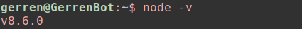
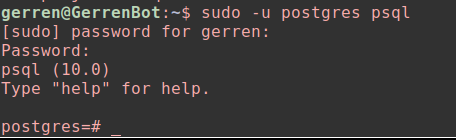
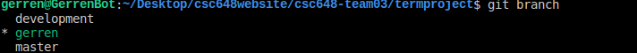
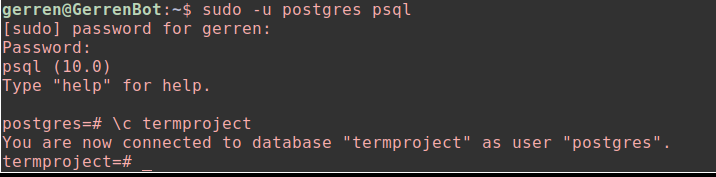
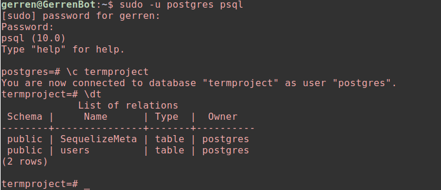
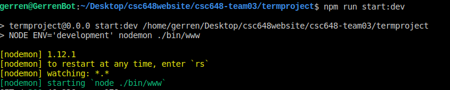
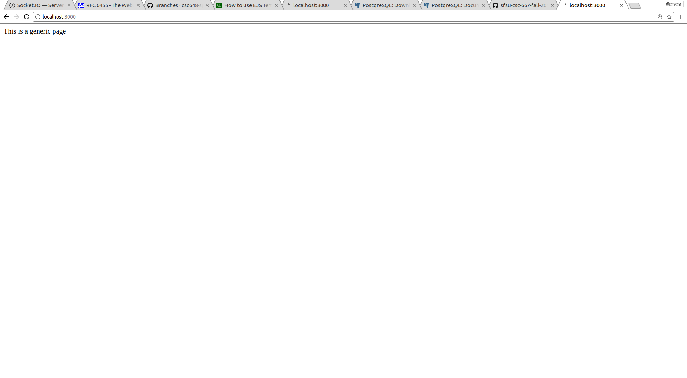

# csc648-team03

## Overview (Please Read)
I have laid out very specific instructions below are the steps each of us will need to execute in order to get our program up and running on our local machines. Please follow them in order, this is very important. I (Gerren) am using Ubuntu 17.04. That being said, some of the command line instructions will be a tiny bit different for Mac users, but it shouldn't be too hard to Google the changes needed to be made. Please let me know if there are any questions. 

## Initial Downloads
Be sure the following is downloaded first before cloning the github repo
* [PostgreSQL](https://www.postgresql.org/download/) - This is the database we  will be using
* [Node.js](https://nodejs.org/en/download/) - Language we will be using for server side coding (npm will be installed with this)
* [VScode](https://code.visualstudio.com/download) or [Atom](https://atom.io/) - Text editor to write your code in (you only need one, they are pretty similar).

## Tests To Check Downloads
* For node testing, just check to see if you have a version of node installed 
    
     

* For postgres testing on linux this works for me:
    
    

  replace "postgres" with the username you used when you downloaded postgres. If you get to this screen, it's downloaded correctly. 

  For mac users the command is a bit different, just google how to access the psql UI, the screen will look similar.

## Instructions To Clone The Repository & Set Up Project 
1.  Create a folder to store the project 
2.  cd into the folder from terminal 
3.  type this command into terminal:
    
    git clone git@github.com:csc648-sp18/csc648-team03.git

4.  Might need to run git fetch to get all branches updated on your local machine
5.  Make your own branch off of the development branch
    
    git checkout development
    
    git checkout -b *your branch name*

6.  Make sure you are in your own branch before continuing, use this command to check:

    git branch

    it should look something like this, but the * should be next your branch name:

    

## Download Dependencies
If you look in our package.json file, there's some dependencies that I used to create the initial project. You must download these dependencies before you run the project. Luckily, this is pretty simple: 
* make sure you cd into termproject
* type this command into terminal
    
    npm install 
* npm install will look at the dependencies in our package.json file and downloads them locally. It will also add in the necessary files to our node_modules folder so that we can import them wherever they are needed in our program. 

## Create The Database In Postgres
1.  Open up terminal and access the psql UI, you should be at this screen:
    
    

2.  Once you are here, type in this command 
    
    CREATE DATABASE termproject;

3.  This should create the database. Try connecting to the database afterwards  by typing his command:
    
    \c termproject

4.  The UI should look like this now: 

    

5. That's it for now, we'll be creating tables in our database shortly, but if you get to this point, you're in good shape.

## Set Up Environment Variables
Since all of us are going to have local versions of the database on our computers, we're going to need a way to connect to them in our program (this is only for development mode, in production mode it'll be different). We're going to tell our program how to connect to the database locally through a .env file that contains an environment variable that specifies exactly which user to look for in the postgres database as well as the name of the database we're connecting to in our program. 

It is important to note that the .env file is a hidden file so if you're trying to view it in the terminal you will need to use:
    
    ls -a

1.  Make sure you are still in the termproject directory
2.  Type in this command to create the .env file:
    
    touch .env

3.  If the above doesn't work, just create a new file called .env 
4.  Now we need to create the actual environment variable that will be referenced when we connect to the database in our program. You can do this by typing this command: 

    echo DATABASE_URL=postgres://`whoami`@localhost:5432/termproject >> .env
  
  *replace whoami with the name of the superuser on your postgres database

5.  If you do this successfully your .env should just contain something like this:
    DATABASE_URL=postgres://gerren@localhost:5432/termproject 

6.  I already added in the lines of code that will tell the program to look into our .env file for the DATABASE_URL variable that tells the program to connect to our postgres database. If you're interested, look in config/config.js, but please don't change anything in these files. 

## Test Database Connection
So in it's current state, our database (termproject) exists, but there are no tables that are holding any data in the database. Let's create a table in the database to test if our database is connecting to the program correctly. 

Luckily, I've already created a table (look in migrations/users.js), I can explain the details of how this works later, but for now let's just make sure we can create tables in our database. 

1.  I've included a script that will run the sequelize command to run pending migrations. All this means is that when we want to make changes to our database, our program will know how to execute these changes when we run this command:
    
    npm run db:migrate 

2.  The only pending migration we had was the users.js table, so on success, the users table should have been added to the database.

3.  To check if the table has been added go into your terminal and access the psql UI. 

4.  Connect to the termproject database
5.  Use this command to list the tables in the database:

    \dt

6.  You should see this screen:   
    
    

7.  If you get to this point, you're good to go! You can also view the table using this command, although it will be empty because we haven't added any data into it. 
    
    

8.  To quit psql just type 

    \q

## Starting The Program
All that's left to do now is start the program and make sure everything is running. In development mode, we're running nodemon. Nodemon is useful because it will automatically restart our server each time a change is made to our program. This is useful because it allows us to see the changes we made instantly. 

1.  Be sure you're still cd into termproject
2.  Type this command to start the server 

    npm run start:dev

    

3.  If no errors appear on the console open up a browser
4.  Type this for the url and press enter:
    
    localhost:3000
5.  On success, you should just see this:

    

6.  To stop the server just press:
    
    ctrl+c

# Milestone 2 

## Quick Setup To Get Your Database Schema Up-To-Date
Here is a list of instructions if you just want to update your schema without knowing the technical stuff. Please contact me if you'd like me go through it with you in person. I already merged with the development branch, so the code in my branch should be up-to-date. I advise that you just merge with my branch first and then go from there. So, first be sure when you type git branch, you are in your own branch then:

        1. git checkout gerren
        2. git pull origin gerren (if you get any weird conflicts contact me and we'll figure it out)
        3. git checkout <your branch>
        4. git merge gerren (If you're using VScode, and there are merge conflicts, I think you'll probably be fine by just clicking "accept incoming changes" on all conflicts)
        5. cd bin
        6. chmod +x dbReset.sh
        7. cd ..
        8. At this point, be sure if you are accessing the termproject database anywhere (ie. You have psql open on another terminal) you shut it down. 
        9. bin/dbReset.sh
        10. Open up psql and connect to the termproject database 
        11. \dt
        11. On success you should see the users, issues, and locations tables. 
        12. If you want you can double check that the migration worked by typing in this to check out a table: 
        select * from issues; 

## Sequelize
Below is information on how we will be using Sequelize in order to quickly modify our database schema. Initially the process will go as follows:
    
1. We run a sequelize command to create the file that tells our database to create a table with specific the attributes (columns) we want included in this table. This step is repeated to create each table. 
2. The files in the migrations and models folders store all of the code that essentially defines our database schema (think of schema as the tables in the database and what information each table will be responsible for holding).
3. We run what is called a "migration" to update the database with the changes specified in our migrations and models directory. What's essentially happening here is that we're telling our program to read our .js files contained in the migrations and models directories. The code in those files tells the database to create tables with columns that hold the specified data types. 
4. Once the migrations are ran, the new tables will be created/modified. 

### Creating new tables
NOTE: You don't need to do this step if you pulled from the gerren branch. I already did it, which is why there are migration and models files for users, location, and issues. I'm just documenting this for clarity.

First, we need to run the command to generate the code that will tell our database to create a table with certain columns. To do this I just use this command: 

        node_modules/.bin/sequelize model:create --name users --attributes       username:text,password:text,email:text,privilege:integer

        node_modules/.bin/sequelize model:create --name locations --attributes city:text,state:text,zipcode:integer,numIssues:integer

        node_modules/.bin/sequelize model:create --name issues --attributes location:integer,user:integer,resolved:text,category:text,img:text,comment:string,title:string
    
Running that command generates a migration file (the file has a bunch of crazy numbers by default, but I re-named it to users.js) and a model file called users.js with code that tells the database to create a table called users and give it columns called username (which stores a string), password (which should stores a string)...etc in each of the files. I repeat this step for the location and issues tables. There are small modifications that need to be made to these files before running the migration, but it's a lot to type out. If you pulled from my branch, don't worry about it, I took care of the changes already. If you're curious about this, just ask me about it, it's easier to explain in person.

### Running the migration   

Throughout the course of the project we are going to run into some hiccups where we need to update the database schema due to various reasons. The quickest way to do this is by modifying files in the migrations and models folders. Once these files are modified to our liking we can simply use the following commands: 

- This command is used to delete the database. We don't want the old version of the database anymore, because maybe we decided to completely remove a table or we completely remove a column from a table: 

         node_modules/.bin/sequelize db:drop

- This command is used to re-create the database. Note that the database will be re-created, but no tables will be stored in the database yet. This is why we need to run the migration: 
        
        node_modules/.bin/sequelize db:create

- This command is used to run the migration files and update the database schema. On success, our database will now have the tables that we told it to create with the exact attributes (columns) for each table:
        
        node_modules/.bin/sequelize db:migrate

NOTE: that once the database is deleted, so is all of the data previously stored inside of it. We'll implement a workaround for this later, but for now just be sure you remember this each time we do this process.
        
### Quick Database Reset
Since it can be kind of annoying to type out the three commands above each time we want to destroy and rebuild the database I made a shell script that will run all three commands for us, it is located in the bin directory. Below are instructions on how to run it. 

1. Before we can run the script we need to give the shell script executable privileges. To do so, run these commands:
        
        cd bin
        chmod +x dbReset.sh

2. Now that we've given the shell script executable privileges, you can cd back into termproject. You should able to run it no problem by using this one command: 

        bin/dbReset.sh

    On success you should see a message that says "Database termproject dropped" follwed by a message saying "Database termproject created"
    followed by a series of messages indicating that certain tables have been created/migrated. 

NOTE: If you are currently accessing the database anywhere (ex: you have psql running in a separate terminal) you must shut it down before running the shell script. The reason for this is because if the termproject database is being accessed anywhere, you will not be allowed to delete the database. 

### Workflow Examples
In this sections I'll just give some sample use cases based on certain scenarios. 

#### Use case #1: 

We're coding up some function that has to deal with an environmental issue. We suddenly realize that the issues table needs to also hold a column that indicates when the post was "last modified". We know that the last modfied will be a "date" data type. So here is how we handle the following situation: 

        1. Go into the migrations/issues.js
        2. Add in the attribute like so: 
            lastModified: {
                type: Sequelize.DATE
            }
        3. Save the file
        4. Shut down any instances of psql that are accessing the database
        5. Open up a terminal
        6. cd into termproject
        7. type bin/dbReset.sh
        8. The above line of code with destroy the database, rebuild it, and update it.
        9. Once the database is recreated and updated you can access the issues table and you will see that it now has a lastModified column.      